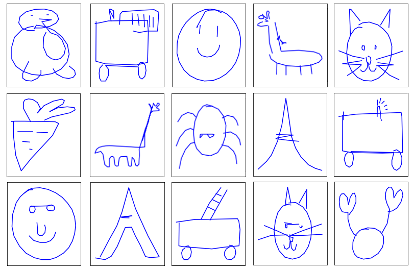
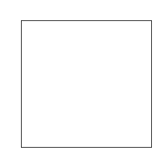

# Teaching a neural network to draw

Starring Pytorch, LSTMs, GMMs, and negative log likelihood maximization.
See the [companion blog post](http://quentin-auge.github.io/teaching-a-neural-network-to-draw.html). 

<table style="border-collapse: collapse;">
    <tr>
      <td valign="middle"></td>
      <td valign="middle"></td>
    </tr>
</table>

See also:
 * the reference [Google Brain paper](https://arxiv.org/abs/1704.03477)
 * the [Jupyter notebook](unconditional.ipynb)

# Data and models

The datasets come from [this repository](https://github.com/googlecreativelab/quickdraw-dataset) (simplified binary format).
They are to be placed in `data/`.

Trained models are available in `models/`. They are single-layer
Pytorch LSTMs outputting parameters for a 20-components GMM, with a
hidden state size of either 128 or 512.

# Setup

The code runs with Python >= 3.6 and Pytorch >= 1.0. Other requirements are listed in `requirements.txt`.
